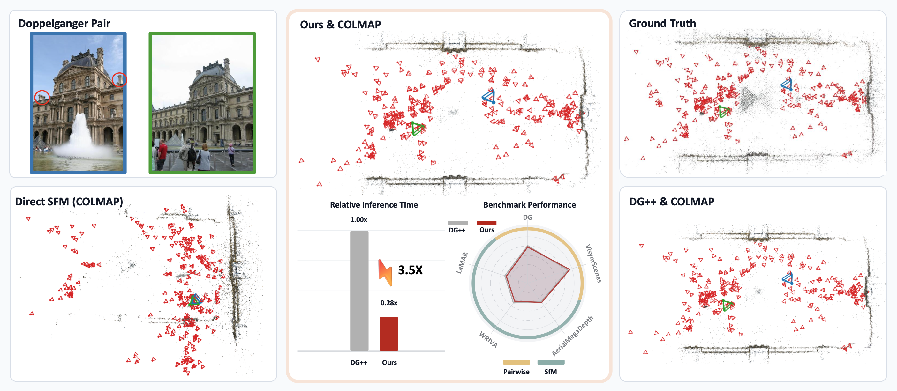

# XDG: Accelerated Visual Disambiguation (WACV 2027)

[*Gonglin Chen*](https://xtcpete.com/), [*Ben Southall*](https://scholar.google.com/citations?hl=en&user=K_7JlMgAAAAJ), [*Hanyuan Xiao*](https://corneliushsiao.github.io/), [*Wenbin Teng*](https://wbteng9526.github.io/), [*Haolin Xiong*](https://haolinxiong.com/), [*Tianwen Fu*](https://twfu.me/), [*Junyi Ouyang*](https://github.com/junyiouy), [*Kshitij Singh Minhas*](https://www.linkedin.com/in/kshitijminhas), [*Supun Samarasekera*](https://www.sri.com/people/supun-samarasekera/), [*Rakesh Kumar*](https://www.sri.com/people/rakesh-kumar/), [*Yajie Zhao*](https://www.yajie-zhao.com/)

[Project Page](https://xtcpete.github.io/xdg/)

## Table of Contents

- [Overview](#overview)
- [Updates](#updates)
- [Installation](#installation)
- [Checkpoints](#checkpoints)
- [Inference](#inference)
  - [Filter a COLMAP database](#filter-a-colmap-database)
  - [Score an explicit pair list](#score-an-explicit-pair-list)
- [Training](#training)
- [Evaluation](#evaluation)
- [Citation](#citation)
- [License](#license)
- [Acknowledgements](#acknowledgements)
- [Third-party code](#third-party-code)

## Overview

XDG detects and removes visually plausible but geometrically inconsistent image
pairs before SfM. By filtering these false-match edges, it prevents corrupted reconstructions and recovers more accurate camera poses. Across pairwise and SfM benchmarks, XDG provides comparable disambiguation performance to DG++ while running 3.5× faster.



## Updates

[08/30/2026] Code and pretrained checkpoint released.

[08/10/2026] XDG has been accepted to WACV 2027.

## Installation

Clone the repository, then create and activate the provided Conda environment:

```bash
git clone https://github.com/xtcpete/xdg.git
cd xdg
conda env create -f environment.yml
conda activate xdg
```

Alternatively, use a Python virtual environment:

```bash
python -m venv .venv
source .venv/bin/activate
python -m pip install --upgrade pip
python -m pip install -r requirements.txt
python -m pip install -e Depth-Anything-3
```

You can also build a docker image with:

```bash
docker build -t xdg .
```

Mount image, weight, and output directories when running the container; these directories are intentionally excluded from the image build context.

## Checkpoints

You can download pretrined checkpoint [here](https://drive.google.com/file/d/1JrhR8dqTVx62aIwdy0YqFAkU3lQRDo0C/view?usp=share_link).

## Inference

Inference uses only the model configuration at [`configs/model_configs/xdg.yaml`](configs/model_configs/xdg.yaml). The file contains the released architecture and the preprocessing/runtime defaults used at inference time.

### Filter a COLMAP database

The database must already contain images and geometrically verified pairs in `two_view_geometries`.

```bash
python remove_doppelgangers.py \
  --config configs/model_configs/xdg.yaml \
  --ckpt weights/xdg.pth \
  --database_path path/to/database.db \
  --input_image_path path/to/images \
  --output_path output/scene \
  --threshold 0.8
```

This writes pair probabilities to `output/scene/pair_probability_list.npy` and creates a filtered copy such as `database_threshold_0.800.db`. The input database is not modified. Then run COLMAP mapper with filtered database.

### Score an explicit pair list

Each non-empty line in the pair file must contain two whitespace-separated image paths relative to `--input_image_path`:

```text
image_0001.jpg image_0002.jpg
subdir/image_0003.jpg subdir/image_0004.jpg
```

Run inference without a COLMAP database:

```bash
python remove_doppelgangers.py \
  --config configs/model_configs/xdg.yaml \
  --ckpt weights/xdg.pth \
  --pairs_txt path/to/pairs.txt \
  --input_image_path path/to/images \
  --output_path output/pairs
```

`--batch_size`, `--img_size`, `--mode`, `--num_workers`, and `--device` can override the model-config defaults.

## Training

Training uses [`configs/training_configs/training.yaml`](configs/training_configs/training.yaml). Its `model_config` field points to the standalone model configuration, so architecture settings have a single source of truth.
At training startup, `model.backbone.model_path` initializes the DA3 backbone from pretrained weights.

The dataset configuration expects NumPy pair metadata files. Each row starts with the two image paths and a binary label; additional metadata columns are allowed. Please follow [doppelgangers++](https://github.com/doppelgangers25/doppelgangers-plusplus) for downloading the datasets. Update the paths under `data.train` and `data.test` for your local datasets, then run:

```bash
python train.py configs/training_configs/training.yaml 
```

Resume training with `--resume_from path/to/last.ckpt`. Override the configured epoch count with `--max_epochs`.

## Evaluation

Validation requires the training config because it needs dataset settings as well as the referenced model config:

```bash
python test.py --ckpt path/to/xdg.pth
```

The Doppelgangers test set is used by default. Evaluate on VisymScenes with
`--dataset visymscenes`; its paths are configured under `data.test_sets` in the training YAML.

The command reports average precision, ROC AUC, operating-point precision/recall, and inference time per pair.

## Citation

If you find XDG useful in your research, please cite:

```bibtex
@misc{chen2026xdgacceleratedvisualdisambiguation,
  title={XDG: Accelerated Visual Disambiguation},
  author={Gonglin Chen and Ben Southall and Hanyuan Xiao and Wenbin Teng and Haolin Xiong and Tianwen Fu and Junyi Ouyang and Kshitij Singh Minhas and Supun Samarasekera and Rakesh Kumar and Yajie Zhao},
  year={2026},
  eprint={2608.29733},
  archivePrefix={arXiv},
  primaryClass={cs.CV},
  url={https://arxiv.org/abs/2608.29733},
}
```

## License

This project is licensed under the [Apache License 2.0](LICENSE).
The license applies to the original code in this repository and checkpoint. Datasets referenced for training 
and evaluation are subject to their respective providers' licenses and terms;

## Acknowledgements

We thank the authors of these great repositories: [Depth Anything 3](https://github.com/ByteDance-Seed/Depth-Anything-3), [Doppelgangers](https://github.com/RuojinCai/doppelgangers), [Doppelgangers++](https://github.com/doppelgangers25/doppelgangers-plusplus), and [COLMAP](https://github.com/colmap/colmap), along with many other inspiring works from the community.

This material is based upon work supported by the Intelligence Advanced Research Projects Activity under prime Contract No. 140D0423C0034. The U.S. Government is authorized to reproduce and distribute reprints for governmental purposes notwithstanding any copyright annotation thereon. Disclaimer: The views and conclusions contained herein are those of the authors and should not be interpreted as necessarily representing the official policies or endorsements, either expressed or implied, of IARPA, DOI/IBC, or the U.S. Government.

## Third-party code

Depth Anything 3 is vendored under `Depth-Anything-3/` and retains its own license in `Depth-Anything-3/LICENSE`.
